# Automação com n8n: Automação para produção de conteúdos de TI

## ⚙ Do breve resumo deste projeto:

Este fluxo automatiza a produção de conteúdos técnicos de Tecnologia da Informação, a serem postados no LinkedIn e/ou redes sociais.

## 📚 Da descrição deste projeto:

A produção de conteúdo é um eterno desafio: o processo criativo não é linear e necessariamente intuitivo. Por muitas vezes, faltam inspiração e regularidade para consolidar o conhecimento compartilhado em newsletters, portais de notícias ou mesmo em perfis de profissionais da área de Tecnologia da Informação.

Desta forma, o objetivo é facilitar esse processo - trazendo o poder do n8n para a produção automática e diária de conteúdo.

---

## 🔎 Das etapas da automação:

Partindo da premissa que já temos uma conta no n8n, o primeiro passo é clicar em "Create Workflow":

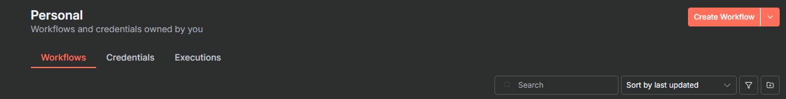

Então, essa tela se abrirá:

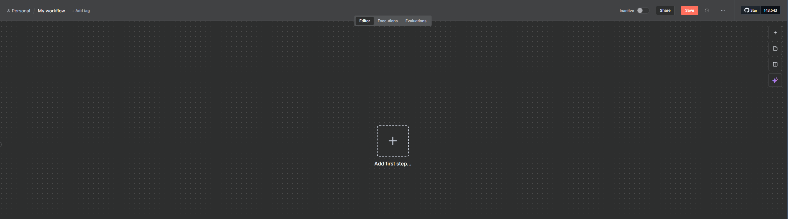

Com isso feito, agora o próximo passo é estabelecermos a nossa planilha no Google Sheets - a qual será a nossa base de apoio para a automação. Como o nosso objetivo é a produção de conteúdos de Tecnologia da Informação, esse é um formato ideal:

**Assunto | Status | Conteúdo**

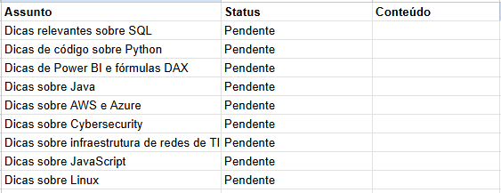

Definida essa estrutura, agora iremos ao n8n.

Clicando em "+", escolheremos a opção Google Sheets > Get row(s) in sheet.

Aberta a tela, devemos configurá-la da seguinte maneira:

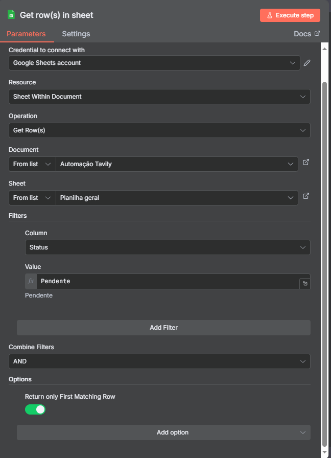

Inicialmente, escolheremos a nossa credencial do Google Sheets e a operação "Get Rows", a qual será utilizada para percorrer e utilizar os registros da nossa planilha. Além disso, também devemos apontar a planilha a ser utilizada, bem como a aba correspondente (o que foi feito).

Como parâmetro, nos basearemos na coluna "Status" e no status "Pendente", para o preenchimento das novas linhas com conteúdo.

Agora, podemos fechar essa tela e clicar novamente em "+", escolhendo a opção "HTTP Request".

Em vez de escolhermos os links de páginas de Tecnologia um a um, utilizaremos uma API para facilitar esse processo.

Nesse caso, a escolhida foi a da [Tavily](https://www.tavily.com/). Ao acessar o website, devemos clicar no botão "Sign Up" - localizado no canto superior direito e criar uma conta.

Assim que criarmos a conta, seremos direcionados para a tela denominada "Overview". Lá, teremos as informações do nosso plano.

Por sua vez, no canto esquerdo, teremos as seguintes opções: 

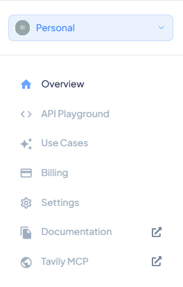

Dessa vez, temos que escolher a opção API Playground > API Keys: lá, criaremos uma chave API. O processo é simples e intuitivo, basicamente apontaremos um nome e clicamos em "avançar". A partir disso, um código será gerado! Devemos copiá-lo, objetivando posterior utilização no n8n.

Com o código "em mãos", voltaremos ao HTTP Request. Como a tela é extensa, optamos por dividí-la em duas; a primeira parte deve estar dessa maneira (dados mascarados por segurança):

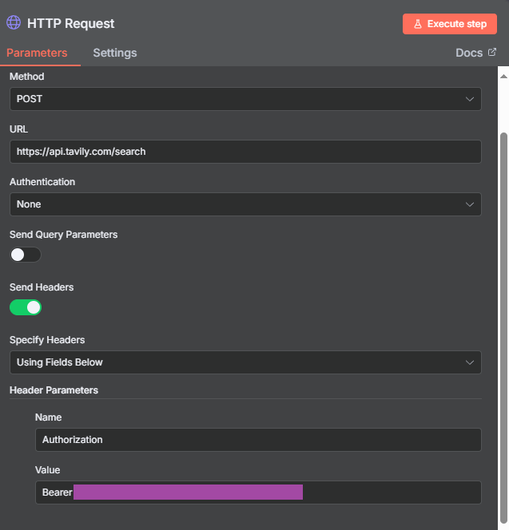

Como vemos, devemos escolher o método POST, a [URL](https://api.tavily.com/search) e no campo "Value", a frase Bearer + a chave API que copiamos anteriormente. 

Prosseguindo, a próxima etapa é retornar ao website do Tavily e clicar em "Documentation", opção que consta no canto esquerdo do painel (vide imagem do Overview, logo acima).

Aberto o link, devemos escolher a opção API Reference. Ou seja: Documentation > API Reference.

Aberta a tela, veremos um exemplo de código no canto superior direito; assim, optaremos por escolher o "cURL" - com o seguinte código de exemplo:

Para facilitar a legibilidade, segue o código na íntegra:

**curl --request POST \
  --url https://api.tavily.com/search \
  --header 'Authorization: Bearer <token>' \
  --header 'Content-Type: application/json' \
  --data '{
  "query": "who is Leo Messi?",
  "auto_parameters": false,
  "topic": "general",
  "search_depth": "basic",
  "chunks_per_source": 3,
  "max_results": 1,
  "time_range": null,
  "days": 7,
  "start_date": "2025-02-09",
  "end_date": "2000-01-28",
  "include_answer": true,
  "include_raw_content": true,
  "include_images": false,
  "include_image_descriptions": false,
  "include_favicon": false,
  "include_domains": [],
  "exclude_domains": [],
  "country": null
}'**

Devemos copiar o código. 

Retornando ao n8n, seguiremos na segunda parte do HTTP Request:

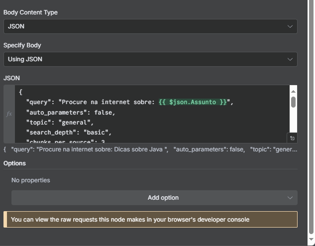

Nesse caso, colaremos o código, alterando o conteúdo da "query", fazendo constar o seguinte: "[...] Procure na internet sobre [...]" e arrastaremos o campo "assunto", constante no input (localizado na mesma tela, à esquerda):

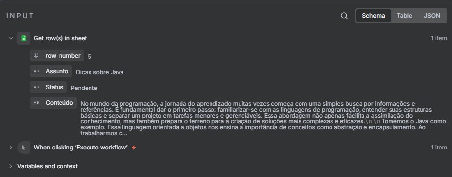

Essas etapas são suficientes para configurar a API do Tavily.

Em continuidade, sairemos dessa tela e escolheremos novamente a opção "+" - e a opção AI Agent > OpenAI Chat Model:

Novamente, as configurações são um pouco mais extensas do que o habitual. Por consequência, explicaremos em detalhes essa etapa:

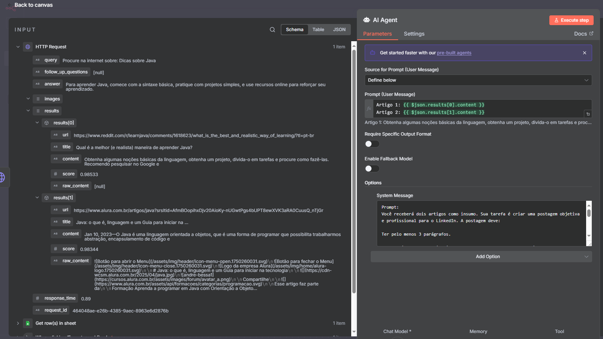

No "Source for prompt", usaremos a opção "Define below", acompanhada do seguinte prompt:

**Artigo 1: {{ $json.results[0].content }}
Artigo 2: {{ $json.results[1].content }}**

Esses trechos de códigos foram arrastados do canto esquerdo, em "content" dos results[0] e results[1], respectivamente.

Por fim, o "system message" pode ser preenchido segundo o prompt de exemplo:

**Você receberá dois artigos como insumo. Sua tarefa é criar uma postagem objetiva e profissional para o LinkedIn ou redes sociais. A postagem deve: Ter pelo menos 5 parágrafos. Ser escrita em um tom inspirador e envolvente, despertando o interesse e a reflexão da audiência. Conectar ideias dos dois artigos, destacando aprendizados, tendências ou insights relevantes. Evitar linguagem muito técnica ou excessivamente informal. Não mencionar explicitamente que os conteúdos vieram de artigos, apenas transmitir a mensagem como se fosse um insight seu. O resultado final deve ser apenas o texto da postagem, sem instruções adicionais.**

Ou seja: usaremos dois artigos como base para as pesquisas posteriores - utilizando o poder do OpenAI para gerar o nosso conteúdo.

Já podemos fechar essa janela.

O último passo é clicar em "+" e escolher novamente a opção Sheets > Update row in sheet.

Como podemos observar, utilizaremos como base a nossa planilha já anteriormente escolhida - mas com as opções "Update row", "Map Each Column Manually" e "Assunto" escolhidas.

Isso garantirá que consigamos gerar os conteúdos e atualizar a planilha conforme executamos o fluxo.

Em "Assunto(using to match)", arrastemos a opção Get row(s) in sheet > Assunto, enquanto na de conteúdo, arrastaremos conforme temos em AI Agent > Output.

Esses passos são suficientes para executar a nossa automação: com um clique em "Execute Workflow", teremos conteúdos de qualidade sobre os temas que nós escolhemos, como se pode ver no exemplo abaixo:

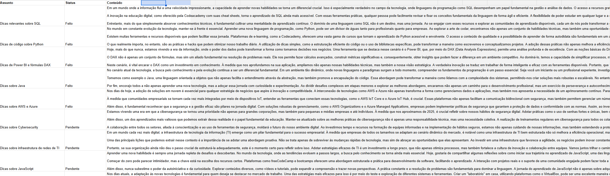

Em poucas palavras, a automação percorre a planilha verificando os temas propostas, gerando os conteúdos e atualizando o status de "Pendente" para "Feito". As possibilidades são diversas e trazem inúmeras sugestões relevantes de conteúdos para a área de Tecnologia da Informação!

Esse será o nosso resultado final:

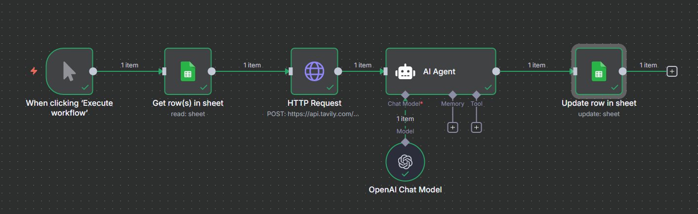

## 📊 Resultados e Insights:

A automação permitiu:

- Identificar quais são os websites disponíveis para a extração de conteúdo;
- Possibilitar a extração dos conteúdos por meio de API oriunda da Tavily, objetivando a obtenção de conteúdos de Tecnologia da Informação na internet;
- O alívio de tempo para priorizar outras demandas, considerando a facilidade de criação automática e relevante de conteúdo em TI. Nos testes feitos, foi inicialmente observada uma economia de 30% no período gasto entre a curadoria de determinado texto e a efetiva postagem no LinkedIn e/ou redes sociais.

## 🔔 Extensões e possibilidades de utilização desse projeto:

Embora o contexto abordado seja o de fornecer conteúdos técnicos para a área de Tecnologia da Informação, essa automação também pode ser utilizada desde para a produção de outras áreas - mas também de matérias voltadas ao autoconhecimento, carreira e empregabilidade, por exemplo.

## 🚀 Como executar:

1. Clone este repositório;
2. Acesse o [site do n8n](https://n8n.io/) e crie uma conta. Preenchidos os dados de cadastro e confirmado o e-mail de utilização, acessar o workflow e seguir os passos descritos no tópico acima;
3. Compare os resultados obtidos.

---

## 🛠 Das ferramentas utilizadas:

Em linhas gerais, utilizarei as seguintes ferramentas nos projetos:

-  → Plataforma de automação;
-  → Criação e manutenção das planilhas essenciais à maioria das automações;
-  → Criação e manutenção de arquivos na nuvem (cloud) para utilização nas automações;
-  → Documentação e versionamento.

---

## 💻 Autor / Contato

Procure-me no LinkedIn: 
