# Automação com n8n: Webscrapping com Apify (extração de dados da web para oferecimento de produtos e serviços)

## ⚙ Do breve resumo deste projeto:

Este fluxo automatiza a coleta de informações de dados de profissionais do segmento desejado, objetivando o posterior contato para o oferecimento de produtos e serviços.

## 📚 Da descrição deste projeto:

Por muitas vezes, é extremamente complicado obter bases de dados íntegras e confiáveis para apoiar as decisões de negócio. Em se tratando da área de marketing, essa questão pode ser ainda mais complicada: onde obter uma relação de profissionais para entrarmos em contato? E mais: como fazer isso de uma maneira rápida, sem ter que procurar manualmente, um a um?

Esse projeto se destina a resolver esse problema com uma automação no n8n, por meio do Webscrapping.

Segundo definição do [Wikipedia](https://pt.wikipedia.org/wiki/Web_scraping), "[...] Webscrapping é uma forma de mineração que permite a extração de dados de sites da web, convertendo-os em informação estruturada para posterior análise. [...]"

Nesse caso, faremos esse processo em poucos cliques, via n8n.

---

## 🔎 Das etapas da automação:

Partindo da premissa que já temos uma conta no n8n, o primeiro passo é clicar em "Create Workflow":

Então, essa tela se abrirá:

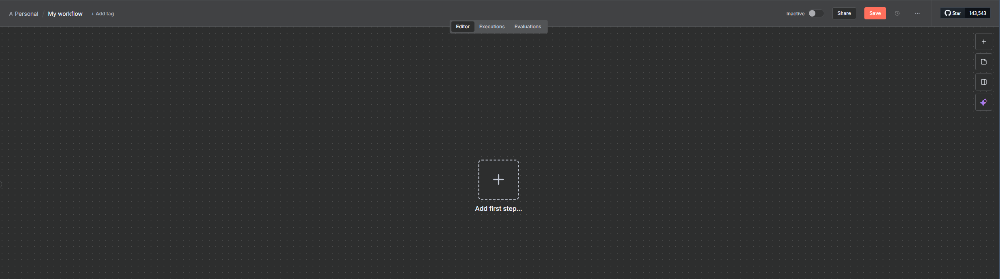

A partir disso, o nosso primeiro passo é criar uma planilha a ser colocada no nosso Google Drive. Ela deve, obrigatoriamente, conter essas colunas:

**Nome | Endereço | Telefone | Site | Localização no mapa | Nota no Google**

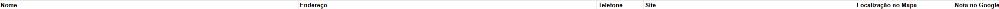

Essa estrutura será fundamental para coletarmos os dados com precisão.

Antes de continuarmos o fluxo no n8n, precisamos criar uma conta no website Apify - o qual será amplamente utilizado para o Webscrapping. Criada a conta, teremos acesso ao console de atores:

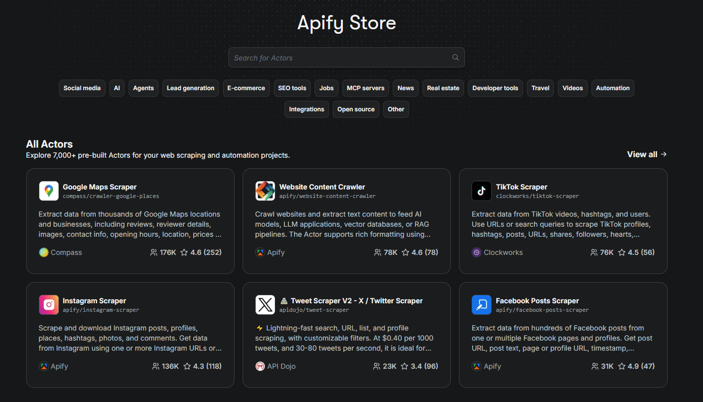

Dentre as mil possibilidades que temos disponíveis, devemos escolher a "Google Maps Extractor":

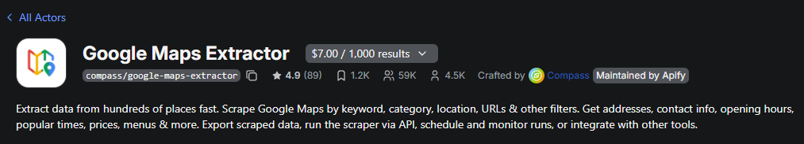

No canto superior direito dessa tela, teremos uma opção chamada API. Então, devemos clicar em API > API endpoints:

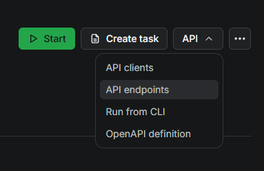

Aparecerão diversas opções. Para o nosso projeto, escolheremos a "Run Actor synchronously and get dataset items" e copiaremos o código localizado logo abaixo (nesse caso, não incluído na imagem, por questão de segurança):

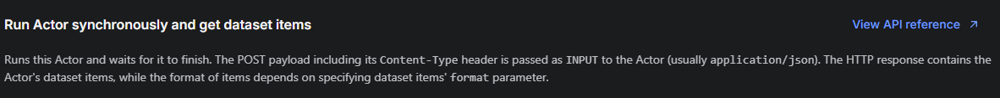

Com isso feito, agora clicaremos em "+" e escolheremos a opção HTTP Request:

A primeira etapa, escolher o campo Method "GET"; logo em seguida, devemos colar o código no campo "URL" (dados mascarados por segurança):

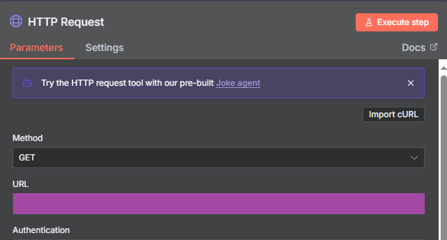

Com isso feito, estabelecemos a conexão com o Apify.

Agora, voltaremos ao website para escolhermos o parâmetro das nossas pesquisas. Neste projeto, buscaremos algumas Pizzarias em São Paulo, Capital, com nota de avaliação no Google em 4.5 estrelas ou superior. Desta forma, precisamos preencher os campos nestes termos:

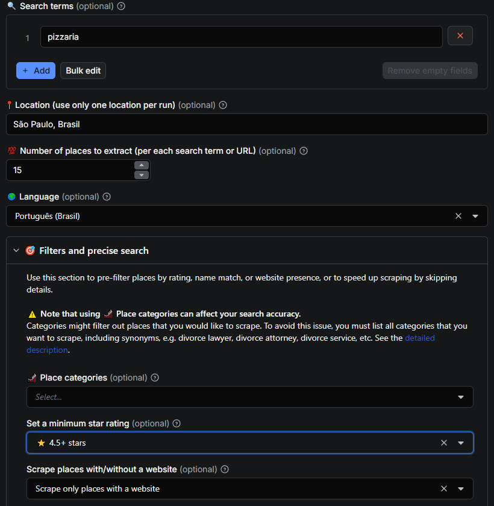

Para facilitar ainda mais o nosso trabalho, logo acima do campo de busca, existem duas opções: "Manual" ou "JSON". Escolheremos a segunda, oportunidade na qual aparecerá um código - e devemos copiá-lo:

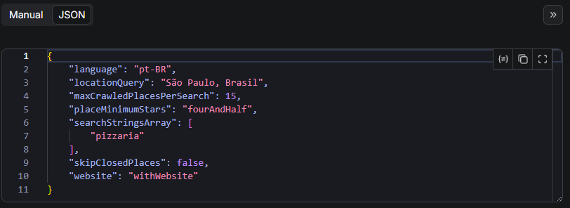

Com o código copiado, devemos voltar à página do n8n para colarmos esse código no campo correto. Portanto, devemos marcar a opção "Send Body", e escolher o campo "Body Content Type" para JSON e colá-lo lá. Consequentemente, o resultado final deverá ser esse:

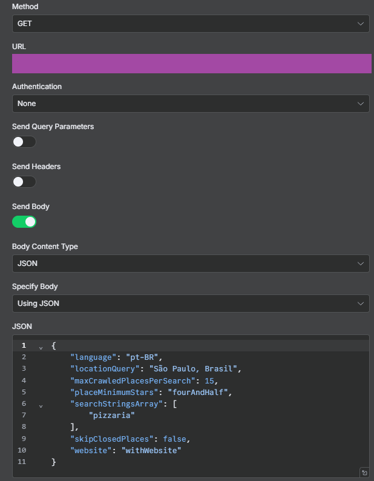

Ao executarmos essa etapa, logo aparecerão os resultados: quinze pizzarias de São Paulo, Capital e todas as informações constantes no Google. Embora os dados sejam públicos, por uma questão de sigilo e de divulgação de informações, optei só por mostrar os campos retornados - e não as informações propriamente ditas:

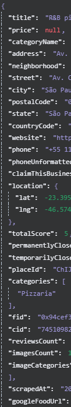

Embora consigamos extrair as informações que desejamos, é preciso organizá-las e categorizá-las para depois colocar em um só arquivo - facilitando a posterior organização.

Como vimos anteriormente, a pesquisa retornará diversos campos. Assim sendo, devemos escolher os campos que mais fazem sentido para a nossa automação, quais sejam: nome, endereço, website, telefone, URL e nota de avaliação. A tela deverá ter essas características:

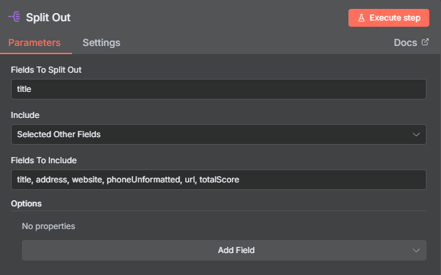

Por fim, a última etapa é incluir esses dados em uma planilha no Google Sheets, para podermos consultá-los quando desejar.

Voltando para a tela inicial do n8n, clicaremos novamente em "+" - escolhendo a opção "Google Sheets" > "Append row in sheet":

Aberta a tela, devemos escolher o arquivo em que usaremos como base, bem como a planilha correspondente. Por fim, basta arrastar os campos que já separamos anterior - de modo que os nossos parâmetros terão essa característica (dados mascarados em razão do sigilo):

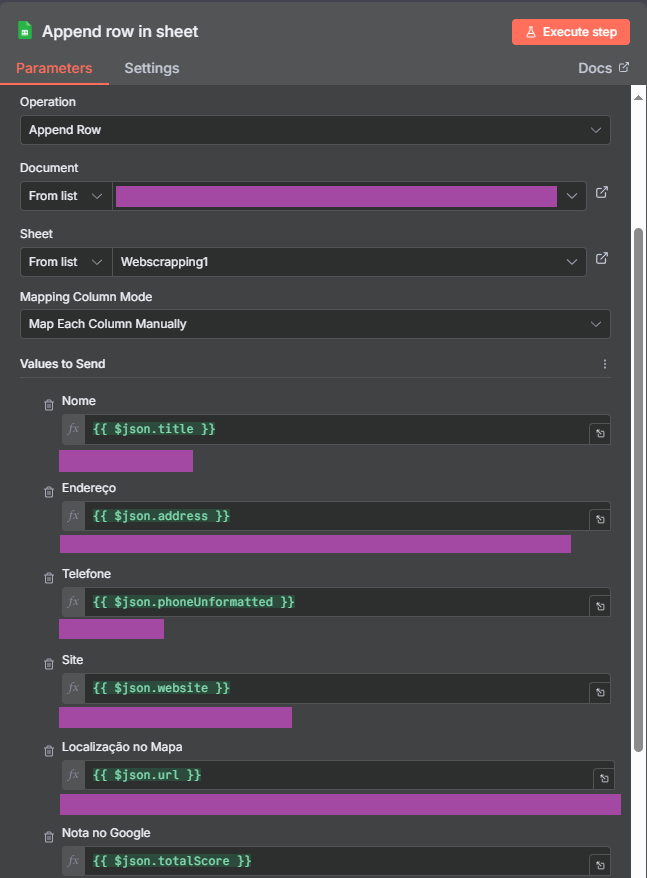

O resultado final será, então, a inclusão das informações das quinze pizzarias no arquivo N8N escolhido - as quais seguirão esse padrão:

**Nome | Endereço | Telefone | Site | Localização no mapa | Nota no Google**

Finalmente, agora temos quinze potenciais clientes para oferecer os nossos produtos e serviços!

O workflow final do nosso projeto deve ficar assim:

## 📊 Resultados e Insights:

A automação permitiu:

- Identificar quais são os websites disponíveis para a extração de conteúdo;
- Possibilitar a extração dos conteúdos por meio de API pública da Google para buscar e categorizar informações (Webscrapping);
- Considerando a morosidade de localizar as empresas, uma a uma, no Google e consolidá-las em um arquivo do Google Sheets - já foi possível diminuir o tempo de busca em até 60%!
- O alívio de tempo para priorizar outras demandas.

## 🔔 Extensões e possibilidades de utilização desse projeto:

Embora o contexto abordado seja o de pesquisar pizzarias, pensando no oferecimento de serviços e produtos - curiosamente, essa automação também pode ser utilizada para fins particulares: pode-se buscar quais são as empresas mais próximas da sua residência que oferecem determinado serviço, por exemplo.

## 🚀 Como executar:

1. Clone este repositório;
2. Acesse o [site do n8n](https://n8n.io/) e crie uma conta. Preenchidos os dados de cadastro e confirmado o e-mail de utilização, acessar o workflow e seguir os passos descritos no tópico acima;
3. Compare os resultados obtidos.

---

## 🛠 Das ferramentas utilizadas:

Em linhas gerais, utilizarei as seguintes ferramentas nos projetos:

-  → Plataforma de automação;
-  → Criação e manutenção das planilhas essenciais à maioria das automações;
-  → Criação e manutenção de arquivos na nuvem (cloud) para utilização nas automações;
-  → Documentação e versionamento.

---

## 💻 Autor / Contato

Procure-me no LinkedIn: 
