# Automação com n8n: resumo de conteúdos da internet

---

## ⚙ Do breve resumo deste projeto:

Este fluxo automatiza a coleta e resumo de tendências do mercado de barbearias, enviando os insights diretamente por e-mail. Ele economiza até 90% do tempo de leitura manual de artigos.

## 📚 Da descrição deste projeto:

Nos dias atuais, muitas profissões demandam estudo e aprimoramento constantes. Novas tendências surgem, novas ferramentas são criadas e novas ideias aparecem em uma velocidade impressionante.

Dessa forma, revela-se imprescindível a tomada de decisões mediante a análise de dados e informações que possam contribuir para com a continuidade do negócio, trazendo novos clientes, geração de caixa e mais prestígio perante o mercado.

Por muitas vezes, esse processo de buscar determinadas informações pode ser demorado e complicado, principalmente se considerarmos que as informações estão dispersas na internet.

Assim sendo, criei uma automação com a plataforma n8n para resumir conteúdos úteis à uma companhia. Desta vez, o negócio escolhido foi uma barbearia: o objetivo aqui é trazer quais são as tendências de cortes masculinos para 2025.

Finalmente, demonstrarei o fluxo da automação, etapa por etapa - o qual pode ser consultado logo abaixo.

---

## 🔎 Das etapas da automação:

1. A primeira etapa, neste caso, é entrar no [site do n8n](https://n8n.io/) e criar uma conta:

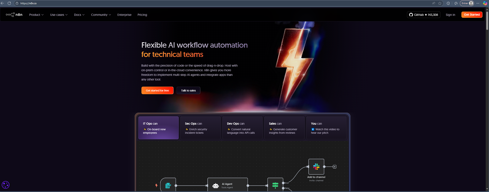

2. Com isso feito, deve-se criar uma conta para poder acessar a plataforma. No meu caso, optei por me utilizar da versão trial (cujo acesso vale por quatorze dias). Preenchidos os dados de cadastro e confirmado o e-mail de utilização, teremos a seguinte tela disponível:

A partir disso, já podemos ingressar na nossa pasta de trabalho.

3. Em continuidade, teremos essa tela para explorarmos:

Neste ponto, devemos compreender como estruturaremos o nosso modelo, para incluirmos as integrações certas, nos locais certos e com os efeitos desejados. Como vimos anteriormente, o nosso objetivo é automatizar a produção de conteúdos para uma barbearia - o que nos leva para a nossa próxima etapa.

4. Primeiramente, teremos que criar uma conta Google com acesso ao Gmail e ao Google Drive, o que pode ser feito por meio desse [link](https://support.google.com/accounts/answer/27441?hl=pt&co=GENIE.Platform%3DDesktop). Em seguida, teremos que configurar uma conta no site da Open AI - mantendedora do ChatGPT. E não basta ser uma conta com configurações normais, devemos também configurar a nossa [chave API](https://openai.com/pt-BR/api/). Segundo a definição da [Alura](https://www.alura.com.br/artigos/api), a API pode ser assim definida: "[...] De forma geral, é um conjunto de padrões, ferramentas e protocolos que permite a criação mais simplificada e segura de plataformas, pois permite a integração e a comunicação de softwares e seus componentes. [...]"

Em poucas palavras, a API será fundamental para estabelecermos conexões entre diferentes sites e plataformas - possibilitando a tão desejada automação.

5. Com esses pontos configurados, agora podemos prosseguir. O primeiro passo, então, é clicar em "add first step"; essa tela se abrirá:

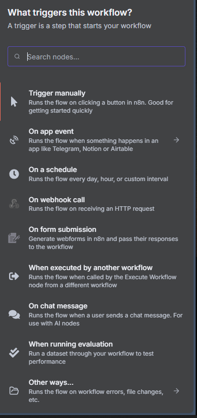

Daí, podemos explorar uma infinidade de softwares e ferramentas compatíveis com o n8n. Neste projeto, utilizaremos o Google Sheets (planilhas do Google), o qual pode ser acessado por meio de um repositório no Google Drive. Ou seja: basicamente, teremos um arquivo equivalente a um Excel em uma pasta na nuvem.

No nosso caso, o arquivo terá essa estrutura:

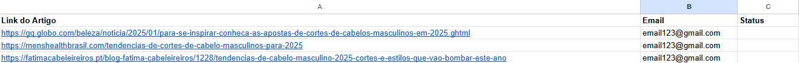

Como se vê, teremos três colunas no total: a) a primeira, chamada "Link do Artigo", b) a segunda, chamada "E-mail" e, c) a terceira, chamada "Status". Ou seja: teremos os links que queremos acessar, o e-mail para qual esse link deverá ser enviado e o status de envio.

À primeira vista, essa estrutura pode parecer desnecessária - mas veremos que ela será de fundamental importância para a nossa automação.

Devemos, então, escolher a opção "Get row(s) in sheet" - oportunidade na qual essa tela se abrirá:

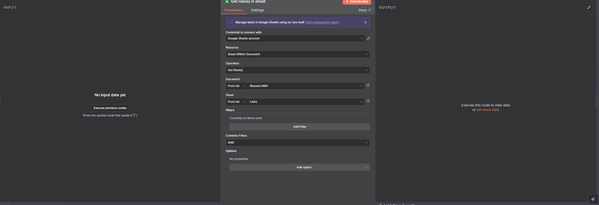

Basta escolher o arquivo desejado no campo "Document" e a aba correspondente, no campo "Sheet". Com isso feito, basta clicar no campo "Execute step". Isso garante que possamos testar o nosso fluxo; neste caso, consistente em coletar os dados da nossa planilha.

6. Em continuidade, devemos voltar fechar essa janela e clicar no ícone "+" para adicionar uma nova etapa. Nesse caso, será uma condição if: a partir desse ponto, a plataforma fará uma varredura no arquivo para verificar qual é o status de envio dos links. A automação só deve ocorrer se o campo estiver vazio, conforme verificamos na imagem abaixo:

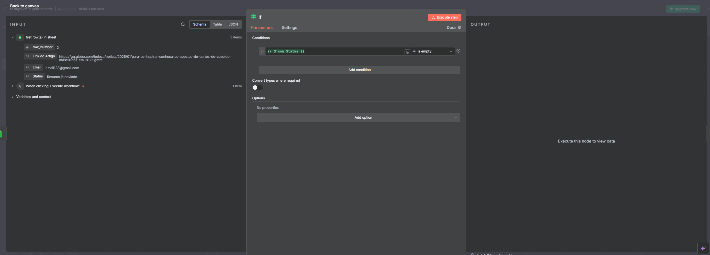

Para definirmos a condição, devemos arrastar o ícone status (localizado na esquerda - input) para o campo disponível e colocar a condição "is empty".

7. Superada essa etapa, fechamos essa janela e novamente clicamos no ícone "+" para escolher a opção "HTTP Request". É por meio dela que requisitaremos acesso aos sites que separamos anteriormente. Novamente, teremos que arrastar um ícone, mas dessa vez é o "Link do artigo", também constante na nossa planilha do Google Sheets:

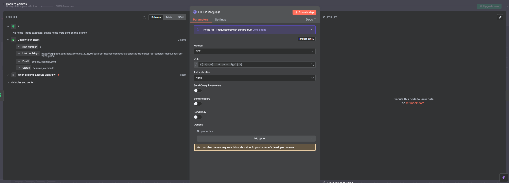

Isso permitirá que acessemos os sites desejados.

8. Depois disso, fechamos uma vez mais a janela e clicamos em "+". Escolheremos a opção "HTML". Desta vez, a meta é extrair os conteúdos de cada link - o que acontece por meio da linguagem HTML:

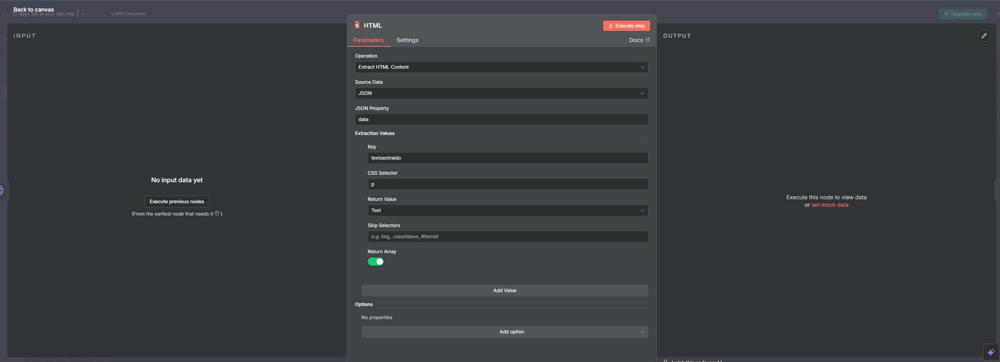

Nesta etapa, escolhemos uma chave, a qual representará um objeto para utilizarmos futuramente e a opção de parágrafo, onde se vê "CSS Selector". No caso em tela, foi escrita a letra "p", que representa parágrafo.

Fechada essa janela, clicaremos novamente no "+" e abriremos uma com a opção "Edit Fields".

9. Isto feito, escrevemos o seguinte código em JavaScript:

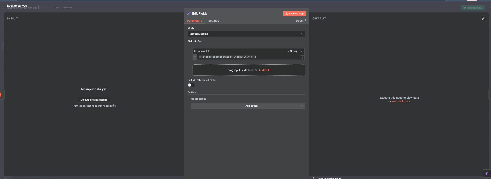

Esse código acessa a chave que criamos anteriormente, juntando tudo em um único elemento de texto e separando cada elemento com duas quebras de linha.

Com isso, estamos prontos para utilizar o ChatGPT para auxiliar nesse processo.

Uma vez mais, fechamos a janela e clicamos em "+". Elegemos a opção "Open AI" > "Message a model".

10. Partindo da premissa que já estamos com a conta na OPEN AI configurada, teremos a seguinte tela:

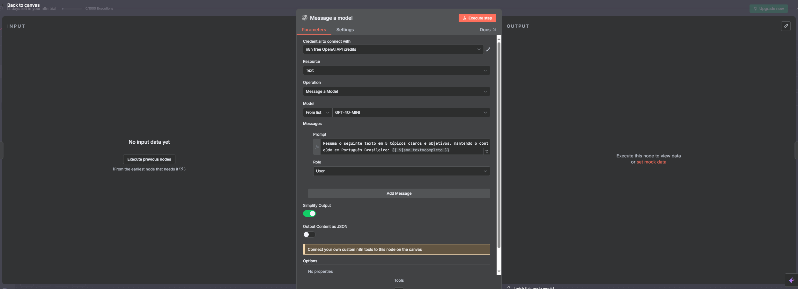

Primeiramente, devemos escolher a versão do ChatGPT a ser utilizada. Para essa análise, escolhemos a GPT-4O-MINI, a qual apresenta bom desempenho nas nossas buscas.

Já no prompt, devemos inserir o seguinte código:

**Resuma o seguinte texto em 5 tópicos claros e objetivos, mantendo o conteúdo em Português Brasileiro: {{ $json.textocompleto }}**

Como já fizemos a extração em HTML em momento anterior, agora arrastaremos o campo "Texto Completo" para a nossa sintaxe - de maneira a garantir que consigamos o resumo dos nossos textos de maneira adequada.

Em posse dos resumos, agora nos resta enviá-los ao e-mail desejado. Fechamos a janela e clicamos em "+".

11. Por opção, escolheremos o "Gmail" > "Send a message":

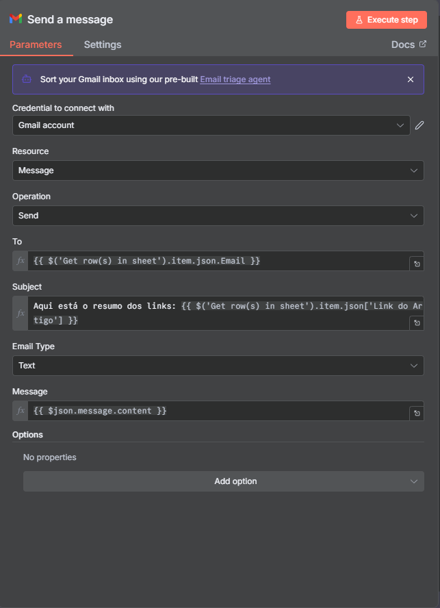

Arrastemos o campo "e-mail" para o destino (To); No assunto, "Subject", escrevemos o seguinte texto:

**Aqui está o resumo dos links: {{ $('Get row(s) in sheet').item.json['Link do Artigo'] }}**

A parte final da sintaxe é trazida do campo "Link do artigo", da nossa planilha no Google Sheets.

Por fim, a mensagem é trazida da opção "Message a model".

O resultado prático é esse: o recebimento de três e-mails com os links resumidos:

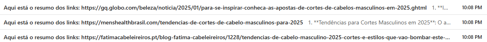

Como exemplo:

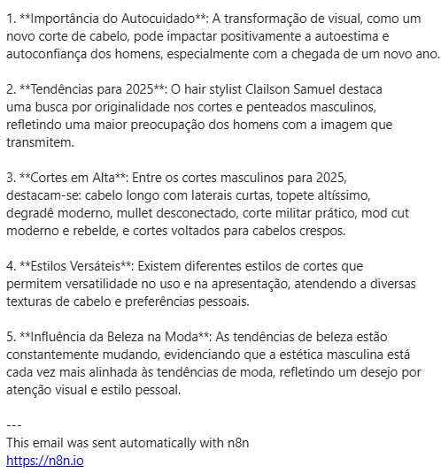

Daí, chegamos no último passo da automação. Fechamos a janela e clicamos em "+".

12. Por último, escolheremos a opção "Google Sheets" > "Update row in sheet":

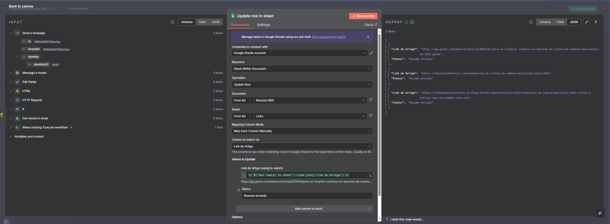

A exemplo do que já preenchemos no início do nosso projeto, resta-nos preencher os campos com o link do artigo (campo trazido do campo "Get row(s) in sheet) para atualizar os campos com o nosso texto, qual seja: "Resumo já enviado".

Já na planilha, esse é o resultado:

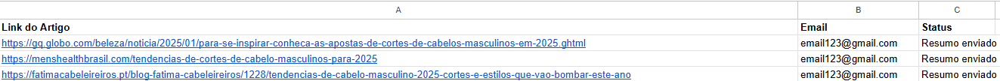

Temos, portanto, os e-mails enviados e a correspodente confirmação (tudo feito automaticamente).

O resultado final do fluxo no n8n deve ser esse:

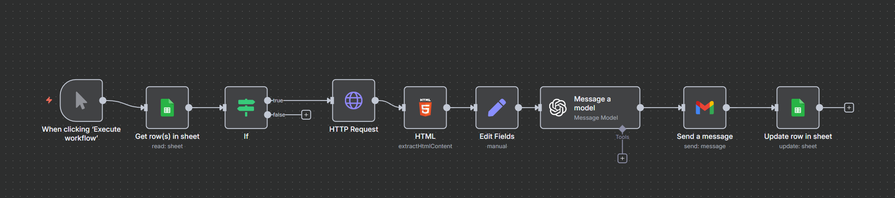

Aqui, acabamos o nosso projeto, com a certeza de que os barbeiros ficarão muito felizes em saber quais são as tendências de cortes masculinos para 2025!

## 📊 Resultados e Insights

A automação permitiu:

- Identificar quais são os websites disponíveis para a extração de conteúdo;
- Possibilitar o resumo dos conteúdos e o envio automático de e-mail para o(s) interessado(s);
- A economia de até 90% no tempo despendido para a leitura e resumo das matérias, se considerarmos o processo de curadoraria, leitura, compreensão e resumo dos textos. Supondo que esse processo antes levava 40 minutos diários, com a automação, temos o mesmo processo - realizado em até 2 minutos;
- O alívio de tempo para estudar e verificar as matérias, o que pode permitir - por exemplo - a marcação de horário para mais um cliente na barbearia.

## 🚀 Como executar

1. Clone este repositório;
2. Acesse o [site do n8n](https://n8n.io/) e crie uma conta. Preenchidos os dados de cadastro e confirmado o e-mail de utilização, acessar o workflow e seguir os passos descritos no tópico acima;
3. Compare os resultados obtidos.

---

## 🛠 Das ferramentas utilizadas

Em linhas gerais, utilizarei as seguintes ferramentas nos projetos:

-  → Plataforma de automação;
-  → Realização de consultas, formatação e transformação de dados;
-  → Criação e manutenção das planilhas essenciais à maioria das automações;
-  → Criação e manutenção de arquivos na nuvem (cloud) para utilização nas automações;
-  → Envio e recebimento de e-mails;
-  → Documentação e versionamento.

---

## 💻 Autor / Contato

Posso ser encontrado nestes endereços:

Esse é o meu GitHub: 

Procure-me no LinkedIn: 
